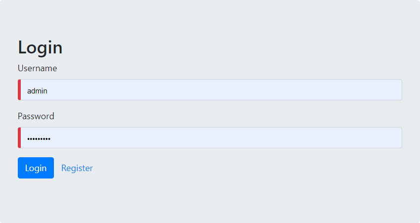
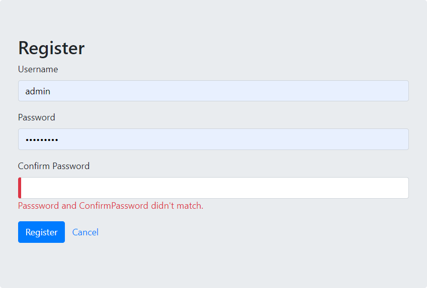
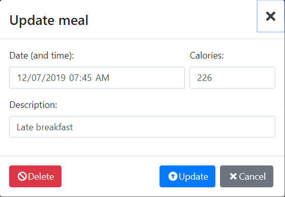
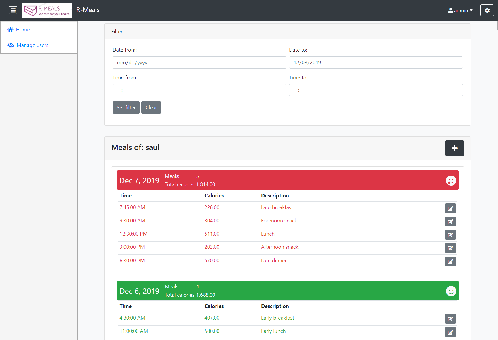
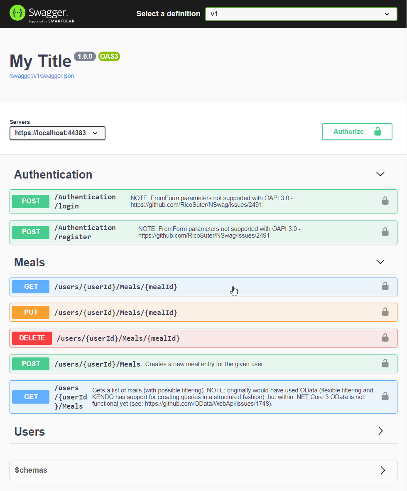

# Meal-tracker
.NET Core API and Angular UI for tracking daily calories (sample project)

**This is a sample application for a .NET Core API & Angular UI (custom admin interface via Bootstrap).**

# The requirements
1. **No 3rd party authentication** (all must be done via the API), user creation has to be supported by UI as well.
2. There should be 3 levels of permissions
   - **user**: able to edit own profile, manipulate own meals (including filtering from based on date and time period)
   - **manager**: should be able to edit user profiles and grant/remove manager roles from user (should not be able to add/remove administrator privileges)
   - **administrator**: same as manager + should be able to grant administator access for users + should be able to edit ever user's profile and meals
3. The meal entry should include date, time, calories and a description
4. Use profile should contain maximum allowed daily calories
5. When the meals of the users are filtered, if daily calory intake is greater than users limit, the entries should be displayed in red (green otherwise).
6. Postman collectin should be included
7. E2E or Unit tests are a bonus

# Screenshots

  

  

  

  

  

<!--

![][1]

[1]: wiki/Login.png
-->
